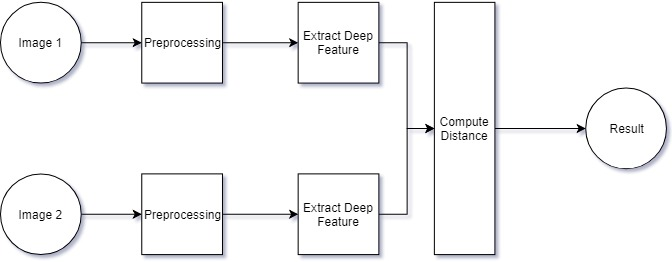
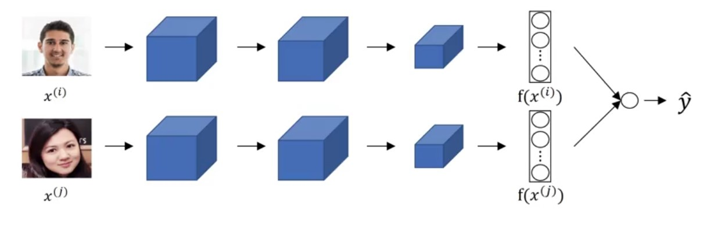
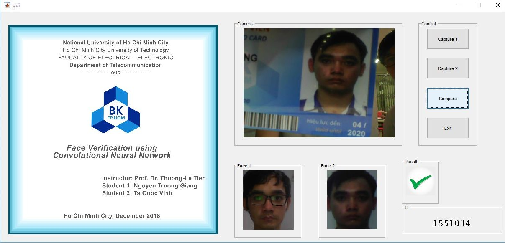
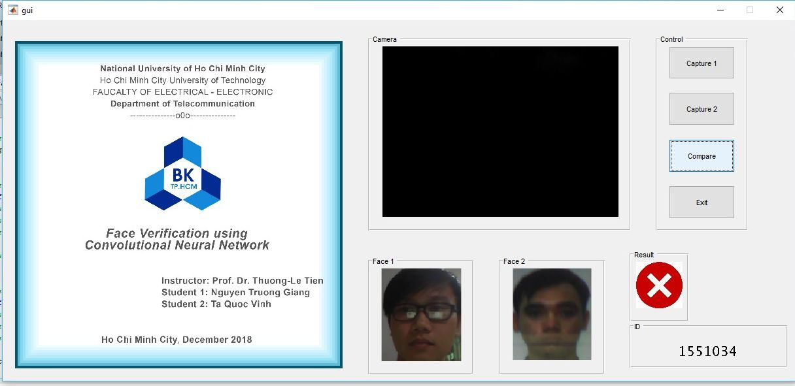
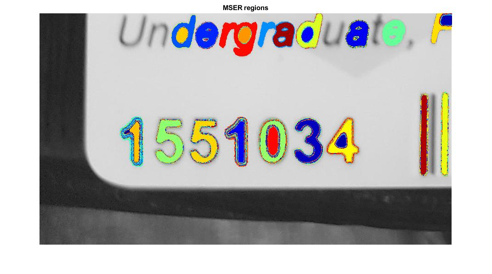

# Combating Exam Impersonation in Universities: An AI-powered Face Recognition System using MATLAB

### Project Overview

This project proposes an AI-powered face recognition system to combat exam impersonation in universities. The system leverages MATLAB, a powerful programming language for scientific and engineering computing, to achieve accurate and efficient facial identification during exams.

### Project Purpose

Exam impersonation is a growing concern in universities, jeopardising the integrity of academic evaluations. This project aims to develop a robust and reliable system to prevent impersonation, ensuring fairness and credibility in the examination process.

### Key Features

- **Real-time face recognition:** The system uses a webcam to capture student images during exams and compares them against a pre-registered database of authorised examinees.
- **AI-powered algorithms:** Advanced machine learning algorithms trained on facial recognition datasets ensure accurate identification, even in challenging lighting or disguise conditions.
- **MATLAB integration:** MATLAB provides a robust and versatile platform for developing and implementing the face recognition system, offering flexibility and scalability.
- **Secure data management:** The system prioritizes data privacy and security, implementing measures to protect student information and prevent unauthorized access.

### Benefits and Impact

This AI-powered face recognition system offers several benefits, including:

- **Enhanced exam security:** Reduces the risk of impersonation and safeguards the integrity of academic evaluations.
- **Fairness and equality:** Ensures that all students are assessed based on their own merit and abilities.
- **Improved student experience:** Creates a more secure and trustworthy examination environment for students.
- **Streamlined exam administration:** Automates the identification process, saving time and resources for exam administrators.

### Conclusion

This project presents a promising solution to address the growing challenge of exam impersonation in universities. By leveraging the power of AI and MATLAB, the system offers a secure, efficient, and reliable approach to ensure the fairness and credibility of academic assessments.

# Requirements 

- [ ]  MATLAB: ≥R2018a
- [ ]  caffee: Deep Learning library for MATLAB
- [ ]  [toolbox-master](https://pdollar.github.io/toolbox/)

# Pipeline

*Face Verification process*

*Face Recognition process*

---

GUI Screenshots

---

### Notes
- Double check path in code to run